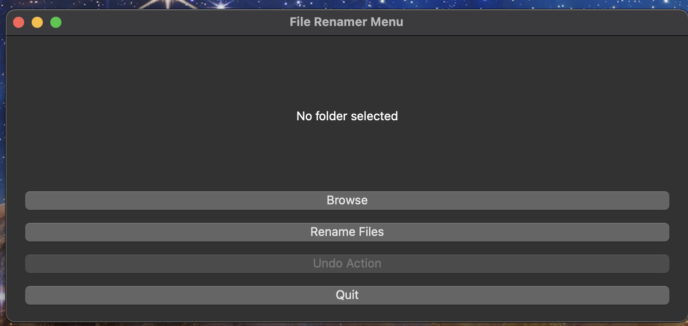
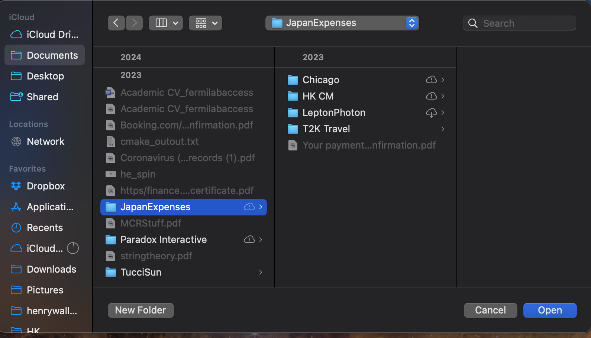

# Useful Software for Zoe!

# Installing as application
Go to https://github.com/henry-wallace-phys/CodeForGoof/releases. Then pick the latest release (highest number!). Then click on the file appropriate for your OS
* **Windows** : `rename_files-windows.exe`
* **Mac-OS**: `rename_files-macos.zip` (note this needs to be decompressed to use)
* **Linux**: `rename_files-linux`

# Using the GUI
Open the gui by clicking on `rename_files-windows.exe` this will pop up

Now, click `browse files` and select the top level folder you want to rename

Press `rename files` to rename all files in this directory and all subdirectories

Press undo if you don't want to do this. Exit by pressing `Quit`.

## Installing from source
In the TOP LEVEL directory run `pip install .`. This will install the package

## Current Functionality
### Replace sub-strings in all files in a folder
By default this replaces all spaces in files with underscores and produces a summary.

This is implemented in both a command line interface (CLI) and a Jupyter notebook. The recommended usage is via a [Jupyter notebook](../notebooks/file_renaming.ipynb) with full instructions written there.

The CLI is an interface useable in the command line through
`rename_files` this will pop up a prompt which lets you put in the directory you want to rename files in! Doing `rename_files -h` will rename the folder.
